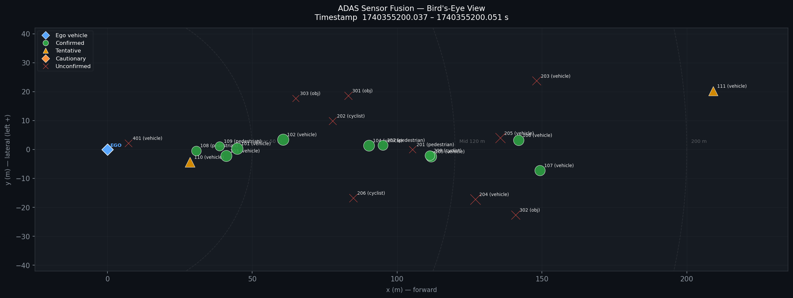
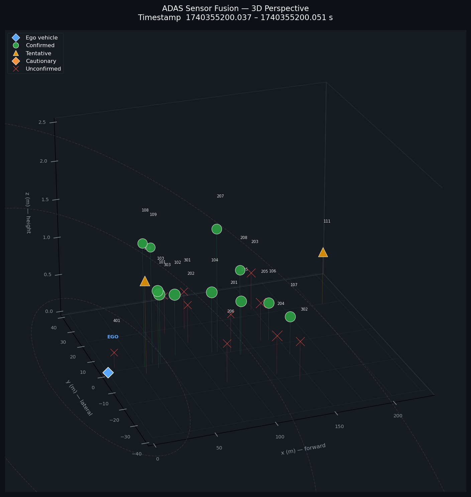
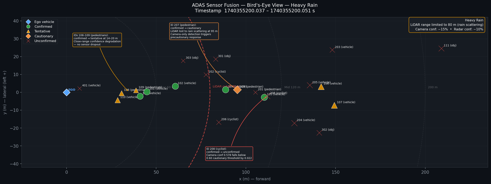
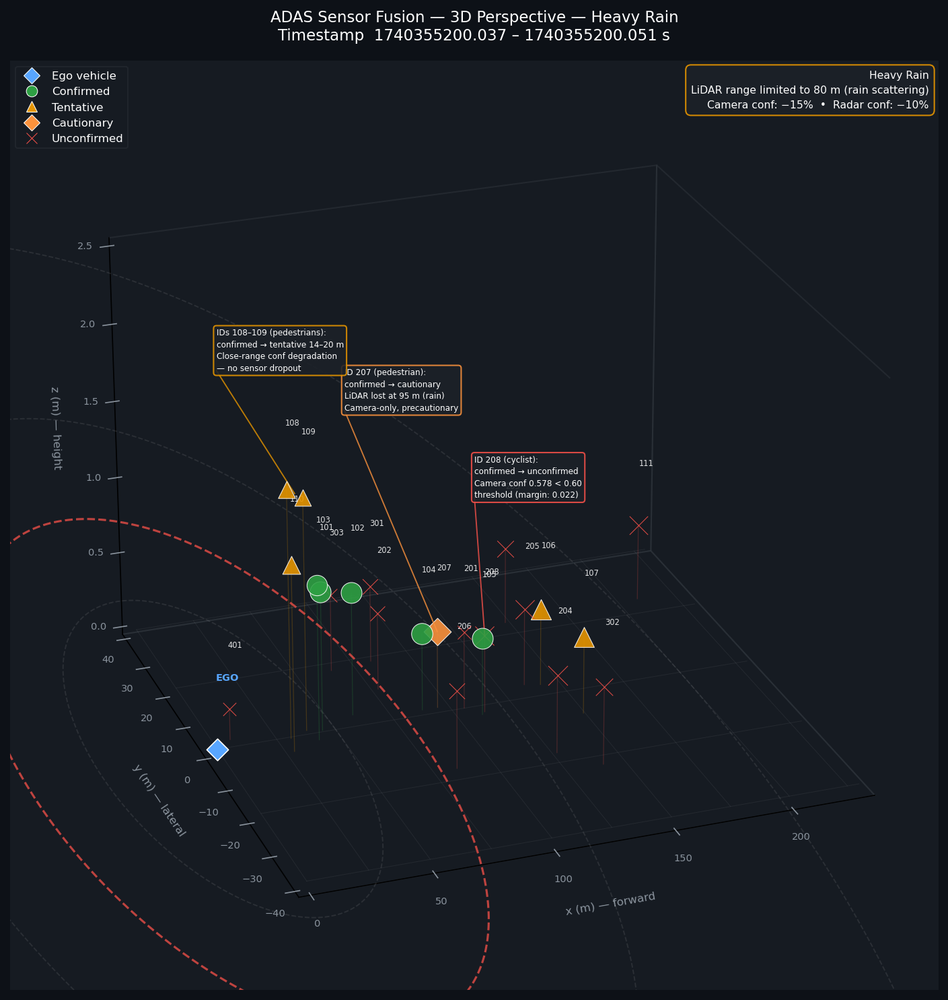

# ADAS Sensor Fusion Visualizer

## Overview

A lightweight sensor fusion prototype demonstrating a multi-sensor object detection pipeline for autonomous driving. The project takes simulated camera, radar, and lidar detection data, fuses them using range-dependent weighted averaging, and outputs bird's-eye-view and 3D perspective visualizations of the fused scene. Built to demonstrate systems-level thinking about sensor integration and safety-aware classification, not as a production fusion algorithm.

## Motivation

In production ADAS systems, no single sensor provides sufficient reliability for safety-critical decisions. Camera provides rich classification but unreliable depth. Radar gives precise range and velocity but poor angular resolution. Lidar offers accurate 3D geometry but degrades at long range and in adverse weather. Effective fusion must account for the physics-driven reliability characteristics of each sensor modality — and those characteristics change with range, weather, and scenario.

## Features

- **Multi-sensor data loading** with per-modality validation and error handling
- **Range-dependent sensor weighting** reflecting real-world sensor physics: lidar dominates in near range (0–50 m) where point density is high, radar weight increases at mid and far range (50 m+) where its time-of-flight measurement remains consistent, camera contributes classification confidence at all ranges but carries low position weight
- **Class-dependent confidence thresholds** with asymmetric risk handling for Vulnerable Road Users
- **Four-tier detection classification**: confirmed, tentative, cautionary, and unconfirmed
- **Bird's-eye-view and 3D perspective visualization** with range zone indicators and confidence-scaled markers

## Architecture

| Module | Responsibility |
|---|---|
| `src/data_loader.py` | Loads and validates sensor JSON files with per-modality type checking |
| `src/environment.py` | Simulates weather-induced sensor degradation; applies physics-based confidence penalties and hard range cutoffs per condition |
| `src/fusion.py` | Matches detections across sensors by object ID, applies range-dependent weighted averaging for confidence and position, classifies detection reliability with class-aware thresholds |
| `src/visualizer.py` | Generates 2D bird's-eye-view and 3D perspective plots with confidence-scaled markers, range zone overlays, and optional weather-condition annotations |
| `main.py` | Orchestrates the full pipeline; accepts an optional `--weather` argument |

## Results

### Clear weather

Bird's-eye-view of all 23 fused tracks in clear conditions. Green circles are confirmed detections, orange triangles tentative, and red crosses unconfirmed. Marker size scales with fused confidence. Dashed rings mark the Near (50 m), Mid (120 m), and 200 m range zone boundaries that govern the sensor weight transitions. Objects 207 (pedestrian, 95 m) and 208 (cyclist, 110 m) appear as confirmed multi-sensor tracks.



3D perspective of the same scene, with object height sourced from LiDAR cluster centroids where available. Vertical stems connect each detection to the ground plane to aid depth perception.



### Heavy rain (simulated)

The same scene after applying `--weather heavy_rain` degradation. The dashed red circle marks the 80 m LiDAR scattering cutoff; all LiDAR returns beyond this boundary are dropped. Callout arrows document the three safety-relevant classification changes described in the [Weather Degradation Analysis](#weather-degradation-analysis) section below. The weather summary box (upper right) states the active sensor penalties.



3D perspective under heavy rain. Objects 207 and 208 lose their LiDAR returns and are plotted at z = 0.5 m (no height data). Stem-line callouts annotate the classification regressions directly in scene space.



## Key Design Decisions

**Range-dependent weighting:** Fixed sensor weights assume constant reliability across distance, which is physically incorrect. Lidar point density drops with range squared, degrading position estimates at distance. Radar maintains consistent range accuracy via time-of-flight regardless of distance. The weighting function interpolates smoothly between near (0–50 m), mid (50–120 m), and far (120 m+) zones to avoid discontinuities at boundaries. In production systems, these weights would typically be learned from ground-truth data rather than hand-set, but explicit engineering rationale is used here to demonstrate the underlying reasoning.

**Class-dependent confirmation thresholds:** The system applies different confidence thresholds depending on the detected object class. VRU detections (pedestrian, cyclist) use a lower confirmation threshold (0.50) than non-VRU detections (vehicle, 0.70). This reflects the asymmetric risk: the consequence of missing a pedestrian (severe injury or death) is categorically worse than a false positive (unnecessary braking). This asymmetry should drive the threshold design.

**The 'cautionary' classification tier:** A blanket rule requiring multi-sensor corroboration before acting on any detection creates a dangerous gap: in degraded sensor conditions (heavy rain, fog, spray), lidar may scatter and radar may generate clutter, while the camera still detects a pedestrian with reasonable confidence. Discarding that detection because it lacks corroboration ignores the most vulnerable road user on the basis of a rigid architectural rule. The 'cautionary' tier addresses this by flagging single-sensor VRU detections with confidence >= 0.60 for precautionary response (speed reduction, driver alert) without requiring full multi-sensor confirmation. This is not equivalent to full AEB activation — it is a proportional response to uncertain-but-safety-relevant information.

**Single-sensor non-VRU detections remain 'unconfirmed':** For vehicle detections, the risk asymmetry is less extreme and vehicles are larger, more consistent radar/lidar targets. Requiring multi-sensor confirmation for vehicles remains appropriate.

## Weather Degradation Analysis

The `src/environment.py` module simulates how adverse weather degrades each sensor modality before fusion. Degradation is applied to a deep copy of the loaded data so the pipeline can compare clean and degraded outputs in the same run. The heavy rain scenario (`--weather heavy_rain`) reveals three distinct safety-relevant findings.

### Supported conditions

| Condition | LiDAR | Radar | Camera |
|---|---|---|---|
| `clear` | Unaffected | Unaffected | Unaffected |
| `rain` | −20% confidence | −5% confidence | −7.5% confidence |
| `heavy_rain` | −40% confidence, max range **80 m** | −10% confidence | −15% confidence |
| `fog` | −50% confidence, max range **60 m** | Unaffected | −30% confidence |
| `snow` | −30% confidence, max range **100 m** | −15% confidence | −20% confidence |
| `night` | Unaffected | Unaffected | −25% confidence |
| `glare` | Unaffected | Unaffected | −40% confidence (forward 30° cone only) |

### Finding 1 — Object 207 (pedestrian, 95 m): safety architecture working as designed

Object 207 is detected by both LiDAR and camera in clear conditions and classified as `confirmed` (fused confidence 0.689, above the VRU threshold of 0.50). In heavy rain, the LiDAR return at 95 m is lost to scattering — beyond the 80 m cutoff. The camera continues to detect the pedestrian; after a 15% confidence penalty its score is 0.612, just above the single-sensor VRU cautionary threshold of 0.60. The track is reclassified as `cautionary`, triggering a precautionary speed reduction and driver alert. This is the cautionary tier functioning as intended: a degraded but still safety-relevant detection receiving a proportional response rather than being discarded.

### Finding 2 — Object 208 (cyclist, 110 m): confidence boundary creates a blind spot

Object 208 follows the same physical path as 207 — LiDAR lost at 110 m, camera-only in heavy rain — but the camera confidence after the 15% weather penalty is 0.578, falling **0.022 below** the 0.60 cautionary threshold. The track is demoted to `unconfirmed` and suppressed from the safety response. The camera is still detecting a real cyclist at 110 m; the classification failure is purely arithmetic. This exposes how fixed confidence thresholds create hard boundaries that weather-induced penalties can push detections across. A production system would need robustness mechanisms at classification boundaries — for example, hysteresis, temporal promotion history, or condition-dependent threshold relaxation.

### Finding 3 — Objects 108/109 (pedestrians, 14–20 m): close-range VRUs lose AEB eligibility through arithmetic alone

Objects 108 and 109 are pedestrians at 14 and 20 m, well within the 80 m LiDAR cutoff. Both retain LiDAR and camera detection in heavy rain — there is no sensor dropout. Despite this, both degrade from `confirmed` to `tentative`. The cause is arithmetic: in the near zone, LiDAR carries approximately 0.46 weight versus 0.29 for camera. The 40% LiDAR confidence penalty therefore dominates the fused score, pulling both tracks below the VRU confirmation threshold of 0.50. The `tentative` tier withholds AEB authorisation. At 50 km/h, a vehicle closes 14–20 m in roughly 1.0–1.4 s — at or below the braking reaction budget. Two real pedestrians at near range lose AEB eligibility through weather-induced arithmetic, not sensor failure.

### Proposed mitigation: proximity-based confirmation floor (not implemented)

The finding above motivates a minimum-range safety override: any VRU detection within a critical proximity zone (suggested ≤ 30 m) should retain `confirmed` status as long as at least one sensor continues to report it, regardless of the fused confidence score. The cost of a false positive (unnecessary braking at short range) is far lower than the cost of a false negative (failure to brake for a pedestrian at 14 m). This override is documented as a design consideration in `src/fusion.py` but deliberately not implemented — the change would require plumbing the representative range into `_classify()` and is subject to its own Hazard Analysis and Risk Assessment review.

## Confidence Thresholds — A Note on Standards

The thresholds used in this project (0.50 for VRU, 0.70 for non-VRU, 0.60 for cautionary single-sensor VRU) are engineering design decisions justified by risk asymmetry, not values prescribed by any regulatory standard. ISO 26262 defines process rigor through ASIL classification — pedestrian detection failure is typically rated ASIL C/D, demanding the most stringent development and validation processes. Euro NCAP defines system-level AEB performance requirements (detection at specific speeds and scenarios). Neither standard prescribes internal fusion confidence thresholds; these are left to the implementer's safety analysis. Production systems would derive these thresholds through extensive validation against ground-truth test data across diverse operating conditions.

## Real-World Considerations

This is a simplified demonstration. A production sensor fusion system would additionally require: temporal tracking across frames to promote tentative and cautionary detections over time, coordinate frame transformations accounting for sensor mounting positions and vehicle ego-motion, probabilistic association (e.g. Hungarian algorithm or JPDA) rather than ID-based matching, environmental context awareness (wiper state, image-based weather classification) to dynamically adjust sensor availability expectations and confirmation requirements, and handling of additional sensor degradation modes including partial occlusion, sun glare, and sensor misalignment.

## How to Run

**Clear weather (baseline):**

```bash
python3 main.py
```

Outputs the fused detection summary to the console and saves visualizations to `output/fusion_result.png` and `output/fusion_result_3d.png`.

**Simulated adverse weather:**

```bash
python3 main.py --weather heavy_rain
```

Applies sensor degradation before fusion, prints a degradation report (detections dropped, average confidence reduction per sensor), and saves annotated visualizations to `output/fusion_result_heavy_rain.png` and `output/fusion_result_3d_heavy_rain.png`. The `--weather` flag accepts: `clear`, `rain`, `heavy_rain`, `fog`, `snow`, `night`, `glare`.

## Requirements

- Python 3.10+
- matplotlib
- numpy
